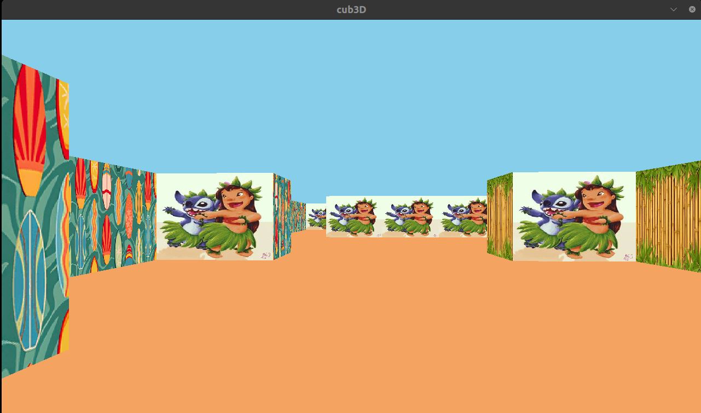
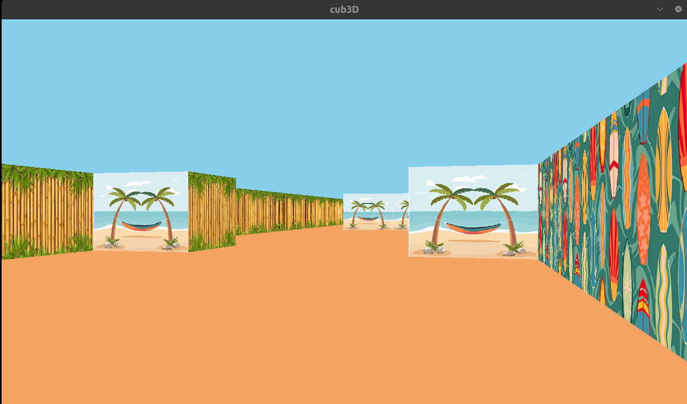

*This project has been created as part of the 42 curriculum by sakdil,segunes*

# cub3D

## Description

**cub3d**  is a 3D game engine project developed using the C language and the miniLibX library, employing Raycasting principles. 

The main goal of the project is to understand the mathematical logic behind classic 3D games and to visualize a 2D map in 3D from a first-person perspective.

### Features:

- Fast wall detection with DDA (Digital Differential Analyzer) lighting.

- Support for different textures for North, South, East, and West walls.

- Customizable ceiling and floor colors.

- Smooth camera and player movement.

## Instructions

### Compilation

To compile the project, type the following command in the terminal:

`make`

To run the program, you need to specify a map file (with a .cub extension):

`./cub3d maps/test.cub`

### Controls:

`W, A, S, D`: Movement

`<-, ->` (Arrow keys): Viewing direction/Camera

`ESC`: Exit game

## Resources

- [Lode's Raycasting Tutorial](https://lodev.org/cgtutor/raycasting.html): The fundamental source of raycasting mathematics.

- [Ray Casting in C - Ismail Assil](https://ismailassil.medium.com/ray-casting-c-8bfae2c2fc13): A comprehensive guide that visualizes and explains DDA software and viewports (camera plane).

- [42 Docs - miniLibX](https://harm-smits.github.io/42docs/libs/minilibx) - miniLibX: Graphics library documentation.

In this project, Artificial Intelligence was used for the following purposes:

* **Algorithm Analysis:** Explanation of the DDA steps and `side_dist` / `delta_dist` calculations [in Ismail Assil's article](https://ismailassil.medium.com/ray-casting-c-8bfae2c2fc13). 

* Detailing the raycasting logic.
* **Debugging:** Understanding where some memory errors come from during map boundary checks.

## Usage Examples

`make`

`./cub3d maps/test.cub`

